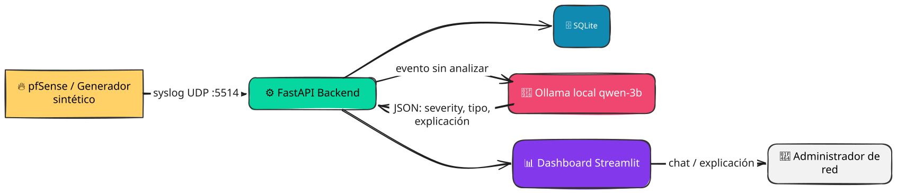
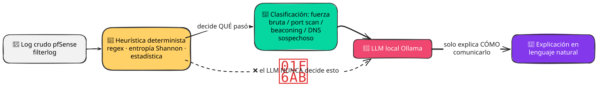
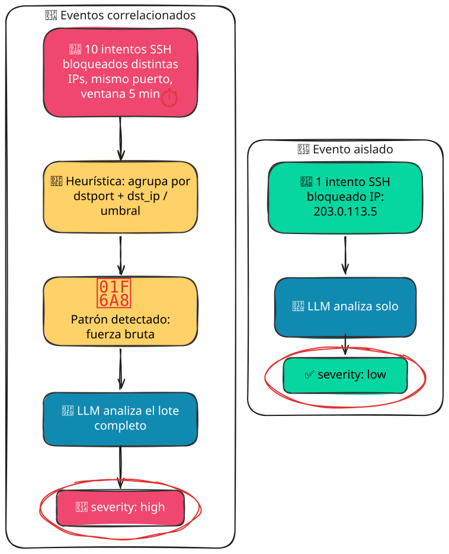

<!-- SLIDE 01 · PORTADA -->

  

    
    PROYECTO FINAL · IA ESTRATÉGICA
  

  

    

      
    

    

      
01 · PROYECTO FINAL

      <h1 class="cover-title">AI-NOC Copilot</h1>
      
Un copiloto de red <strong>100% local</strong> para convertir eventos de infraestructura en decisiones operativas explicables.

      

        
<strong>AI</strong>Artificial Intelligence

        
<strong>NOC</strong>Network Operations Center

      

    

  

  

    

AUTOR

Marcos Ruíz

    

CURSO

IA Estratégica: El Programador Aumentado

    

FECHA

2026

    
⌁ github.com/0xmarcosdev/ai-noc-copilot

  

---
zoom: 0.85
---

<!-- SLIDE 02 · EL PROBLEMA -->

  

    
02 · EL PROBLEMA

    <h2>¿Cómo llevamos IA a una red que no puede hablar con Internet?</h2>
  

  

    

      
EL CONTEXTO OPERATIVO

      

        

NOC
<strong>Dirección territorial</strong><small>Recepción · análisis · respuesta</small>

        
SUCURSAL 01

        
SUCURSAL 02

        
SUCURSAL 03

        
… múltiples sucursales

      

      
Arquitectura <strong>hub-and-spoke</strong>: muchos cortafuegos pfSense convergen en una sede central.

    

    

      

        
01

        
<h3>Una frontera de seguridad</h3>
La red corporativa opera <strong>sin acceso a Internet</strong> por políticas de seguridad.

      

      

        
02

        
<h3>Muchos puntos de observación</h3>
Cada sucursal genera eventos. La sede central termina recibiendo el ruido de toda la infraestructura.

      

      

        
03

        
<h3>El volumen oculta el patrón</h3>
Un evento aislado puede parecer irrelevante. Varios eventos relacionados pueden contar una historia completamente distinta.

      

      

        →
        <strong>Desafío:</strong> llevar capacidad de IA al entorno aislado sin sacar los datos de la red.
      

    

  

---
zoom: 0.91
---

<!-- SLIDE 03 · OBJETIVO -->

  

    
03 · EL OBJETIVO

    <h2>Un copiloto que observa, correlaciona y explica</h2>
  

  

    

      
AI-NOC

      <h3>No reemplaza al administrador. Le quita ruido.</h3>
      
La aplicación convierte logs de firewall en información operativa estructurada, manteniendo la clasificación de seguridad fuera del LLM.

      

        LOGS <b>→</b> HEURÍSTICA <b>→</b> CONTEXTO <b>→</b> EXPLICACIÓN
      

    

    

      

01

<h3>Ingerir</h3>
Recibir y normalizar logs provenientes de pfSense.

      

02

<h3>Persistir</h3>
Guardar los eventos en SQLite para consulta y análisis.

      

03

<h3>Detectar</h3>
Aplicar regex, entropía y estadística de forma determinista.

      

04

<h3>Correlacionar</h3>
Relacionar eventos para encontrar patrones que un evento aislado oculta.

      

05

<h3>Explicar</h3>
Usar un LLM local para traducir el resultado a lenguaje natural.

    

  

---
zoom: 0.87
---

<!-- SLIDE 04 · ARQUITECTURA -->

  

    
04 · ARQUITECTURA GENERAL

    <h2>Del log bruto a una explicación accionable</h2>
  

  

    
  

  

    
<strong>Entrada</strong>logs pfSense

    
→

    
<strong>Ingesta</strong>parseo + SQLite

    
→

    
<strong>Detección</strong>heurísticas

    
→

    
<strong>Correlación</strong>contexto temporal

    
→

    
<strong>LLM local</strong>explicación

  

  

    ●
    <strong>Todo permanece dentro de la red corporativa.</strong>
    Sin API externa · sin nube · sin transferencia de logs.
  

---
zoom: 0.88
---

<!-- SLIDE 05 · DECISIONES DE DISEÑO -->

  

    
05 · DECISIONES DE DISEÑO

    <h2>Diseñar para el entorno real, no para el caso ideal</h2>
  

  

    

      
01

      

        DECISIÓN
        <h3>Clasificación determinista</h3>
        
La seguridad no depende de una respuesta probabilística. Regex, entropía y estadística producen el veredicto.

        
<strong>Trade-off</strong> Menos flexibilidad semántica, mucha más trazabilidad.

        
→ Resultado: comportamiento reproducible.

      

    

    

      
02

      

        DECISIÓN
        <h3>LLM local como capa de explicación</h3>
        
Ollama + modelo local reciben únicamente el contexto que ya fue producido por el motor determinista.

        
<strong>Trade-off</strong> Menor capacidad que un modelo cloud, pero cero dependencia externa.

        
→ Resultado: IA útil dentro del air-gap.

      

    

    

      
03

      

        DECISIÓN
        <h3>Ollama nativo en el host</h3>
        
El runtime del modelo corre directamente sobre el sistema, evitando una capa de virtualización innecesaria.

        
<strong>Trade-off</strong> Menos aislamiento, pero acceso más directo a CPU/RAM/GPU.

        
→ Resultado: despliegue local más simple.

      

    

    

      
04

      

        DECISIÓN
        <h3>SQLite + Streamlit para el MVP</h3>
        
Se priorizó una arquitectura pequeña, auditable y fácil de desplegar en una infraestructura sin Internet.

        
<strong>Trade-off</strong> Menor escalabilidad que una plataforma distribuida.

        
→ Resultado: MVP operativo con baja complejidad.

      

    

  

  

    La pregunta no fue <strong>“¿qué tecnología es más potente?”</strong> sino <strong>“¿qué arquitectura funciona aquí?”</strong>
  

---
zoom: 0.88
---

<!-- SLIDE 06 · DETERMINISMO + LLM -->

  

    
06 · PRINCIPIO NO NEGOCIABLE

    <h2>La IA no decide qué ocurrió</h2>
  

  

    

      
    

  

  

    

      
01

      
HEURÍSTICA<h3>Decide QUÉ pasó</h3>
Identifica patrones, calcula señales y asigna la clasificación de seguridad.

    

    

      
02

      
LLM LOCAL<h3>Explica CÓMO comunicarlo</h3>
Convierte el resultado estructurado en una explicación útil para el operador.

    

    

      
03

      
GUARDRAIL<h3>El modelo no puede cambiar el veredicto</h3>
Si el LLM falla, la detección continúa siendo válida.

    

  

---
zoom: 0.85
---

<!-- SLIDE 07 · CORRELACIÓN -->

  

    
07 · CORRELACIÓN

    <h2>Un evento puede ser ruido.</h2>
    
El patrón cuenta una historia.

  

  

    

      
ANTES

      

        
LOW

        
<strong>Evento aislado</strong>
Un intento de conexión sospechoso. Sin suficiente contexto para elevar la prioridad.

      

      
+++

      
DESPUÉS

      

        
HIGH

        
<strong>Eventos correlacionados</strong>
Múltiples señales relacionadas en tiempo, origen, destino o comportamiento.

      

      

        ↗
        
<strong>La severidad cambia porque cambia el contexto.</strong>
No porque el LLM “opine”, sino porque el motor encontró evidencia adicional.

      

    

    

      

        
      

    

  

---
zoom: 0.85
---

<!-- SLIDE 08 · DEMO -->

  

    
08 · DEMO EN VIVO

    <h2>Del log al diagnóstico explicado</h2>
  

  

    

      

        
        <label>AI-NOC COPILOT / LIVE</label>
      

      

        
$ ainoc analyze --source pfsense

        
✓ 128 eventos ingeridos

        
✓ 17 patrones detectados

        
! 4 eventos correlacionados

        
! 1 patrón elevado a HIGH

        
AI generando explicación local...

        

          SEVERITY
          <strong>HIGH</strong>
          
Múltiples eventos relacionados sugieren un patrón de actividad coordinada. Revisar origen y frecuencia.

        

      

    

    

      

01

INGESTA<h3>Cargar logs pfSense</h3>
El sistema recibe eventos reales o sintéticos.

      

      

02

ANÁLISIS<h3>Ejecutar heurísticas</h3>
Regex, entropía y señales estadísticas.

      

      

03

CORRELACIÓN<h3>Construir contexto</h3>
Relacionar eventos del mismo patrón.

      

      

04

EXPLICACIÓN<h3>Consultar el LLM local</h3>
Ollama transforma el resultado en lenguaje natural.

      

      

05

DASHBOARD<h3>Mostrar el resultado</h3>
Evidencia + contexto + explicación.

    

  

  

    
    <strong>La demo muestra el flujo completo, no una maqueta.</strong>
    Entrada → detección → correlación → explicación → dashboard
  

---
zoom: 0.95
---

<!-- SLIDE 09 · STACK + CALIDAD -->

  

    
09 · STACK Y CALIDAD

    <h2>Un MVP pequeño, medible y reproducible</h2>
  

  

    

      
CAPA DE APLICACIÓN

      

        

<strong>Python</strong>Backend + lógica de detección

        

<strong>Streamlit</strong>Dashboard operativo

        

<strong>SQLite</strong>Persistencia local

        

<strong>Git + GitHub</strong>Versionado del proyecto

      

      
IA + RUNTIME

      

        

<strong>Ollama</strong>Runtime LLM local

        

<strong>my-qwen-3b</strong>Modelo local de explicación

        

<strong>Regex</strong>Detección de patrones

        

<strong>Shannon</strong>Entropía + señales estadísticas

      

    

    

      
CALIDAD VERIFICABLE
37/37

      

✓

<strong>Tests automatizados</strong>37 de 37 pruebas pasando

      

✓

<strong>Linting</strong>Código validado con herramientas de calidad

      

✓

<strong>Python fijado</strong>Versión definida para reproducibilidad

      

✓

<strong>Arquitectura offline</strong>Sin dependencia de servicios cloud

      
PRINCIPIO<strong>Si no puedo probarlo, no debería confiar en él.</strong>

    

  

---
zoom: 0.92
---
<!-- SLIDE 10 · EVIDENCIA IA -->

  

    
10 · EVIDENCIA DE USO DE IA

    <h2>La IA también fue parte del equipo de desarrollo</h2>
  

  

    

      
01ORQUESTACIÓN

      

<strong>Claude App</strong>Claude Sonnet 5 / Opus

      
Descomposición del proyecto, planificación de tareas, revisión de arquitectura y coordinación del trabajo.

    

    

      
02EJECUCIÓN DE CÓDIGO

      

        

        

        

        

        

      

      
<strong>VS Code · Cursor · Windsurf · OpenCode · DeepSeek Harness</strong>modelos free tier

      
Implementación, refactorización y ejecución de tareas con múltiples IDEs y modelos vía API / OpenRouter.

    

    

      
03VERIFICACIÓN

      

<strong>DeepSeek App</strong>DeepSeek-V4 Pro/Flash

      
Contrastar afirmaciones técnicas, investigar documentación y verificar decisiones antes de incorporarlas.

    

    

      
04DATOS SINTÉTICOS

      

        

        

      

      
<strong>Claude + Perplexity</strong>Sonnet · Sonar free tier

      
Crear escenarios de prueba, eventos sintéticos y casos diseñados para validar detección y correlación.

    

    

      
05DEBUGGING

      

        

        

      

      
<strong>Grok + Qwen</strong>Grok-4.6 · Qwen 3.7-Plus

      
Análisis de errores, hipótesis de causa raíz y propuestas alternativas durante la depuración.

    

    

      
06DOCUMENTACIÓN

      

<strong>Gemini + NotebookLM</strong>Gemini 3.6 Flash free tier

      
Síntesis de documentación, organización del conocimiento y preparación de material técnico del proyecto.

    

  

  

    IDEA CLAVE
    <strong>La IA aceleró el desarrollo. La responsabilidad de las decisiones siguió siendo del autor.</strong>
  

---

<!-- SLIDE 11 · ROADMAP -->

  

    
11 · ROADMAP

    <h2>Lo que queda fuera del MVP también es una decisión</h2>
  

  

    

      
MVP ACTUAL

      <h3>Pequeño por diseño.</h3>
      

        
✓ Ingesta de logs pfSense

        
✓ Persistencia SQLite

        
✓ Heurísticas deterministas

        
✓ Correlación de eventos

        
✓ LLM local para explicación

        
✓ Dashboard Streamlit

      

    

    

    

      

01

<strong>Más fuentes</strong>
Switches, IDS/IPS, servidores y endpoints.

      

02

<strong>Respuesta asistida</strong>
Playbooks y acciones sugeridas al operador.

      

03

<strong>Modelos especializados</strong>
LLMs y clasificadores adaptados al dominio de red.

      

04

<strong>Escalabilidad</strong>
Procesamiento distribuido para grandes volúmenes.

    

  

  

    ¿POR QUÉ NO AHORA?
    <strong>Porque cada capa adicional aumenta superficie de fallo, complejidad y esfuerzo de validación.</strong>
  

---

<!-- SLIDE 12 · CIERRE -->

  

    

      
12 · CIERRE

      

      <h1>Inteligencia artificial donde no hay Internet.</h1>
      
AI-NOC Copilot demuestra que un entorno aislado no tiene por qué quedar fuera de la revolución de la IA.

      

        DATOS LOCALES <b>+</b> HEURÍSTICA <b>+</b> LLM LOCAL <b>=</b> <strong>IA OPERATIVA</strong>
      

    

    

      
AUTOR<strong>Marcos Ruíz</strong><small>IA Estratégica: El Programador Aumentado</small>

      
REPOSITORIO<strong>github.com/0xmarcosdev/ai-noc-copilot</strong>

      
Gracias<small>Preguntas · comentarios · demo</small>

    

  

